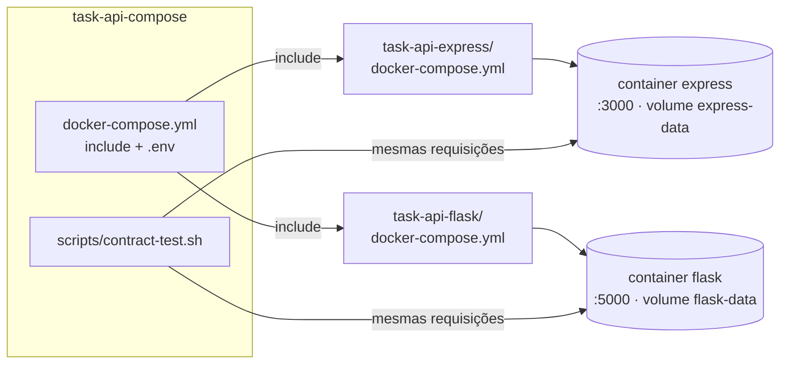
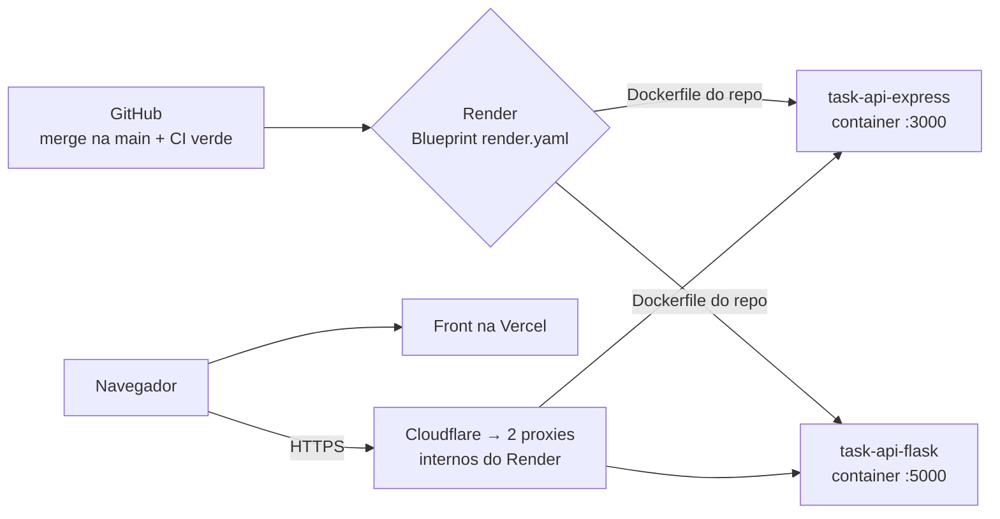

# Task API Compose — Anotações de estudo

> **Data:** 2026-10-06 (atualizado em 2026-10-09) · **Stack:** Docker Compose · Bash · GitHub Actions · ShellCheck ·
> Render (Blueprint)

---

## 1. Visão geral

Repositório **sem código de aplicação**: ele sobe juntas as duas versões da API de tarefas, a Express
(`task-api-express`, porta 3000) e a Flask (`task-api-flask`, porta 5000), e verifica com um **teste de contrato**
que as duas respondem igual.

Ele existe porque as APIs vivem em repositórios separados. Só um terceiro repositório, que enxerga os dois, consegue
testar a comparação entre eles.

Depois, ele virou também o lugar da **infraestrutura de produção**: o `render.yaml` (*Blueprint*) daqui define as
duas APIs no Render, incluindo o CORS liberado só para o front publicado na Vercel.

| Em produção | URL |
|---|---|
| API Express | https://task-api-express-2pva.onrender.com |
| API Flask | https://task-api-flask-1ozq.onrender.com |
| Front (Angular, outro repositório) | https://task-app-angular-taupe.vercel.app |

---

## 2. Arquitetura



### Em produção



- O Render lê o `render.yaml` **deste** repositório, mas constrói cada API a partir do `Dockerfile` do repositório
  dela (campo `repo`).
- O navegador carrega o front da Vercel e chama as APIs diretamente. Por isso as APIs precisam liberar a origem do
  front no CORS.

### Pastas

Os três repositórios precisam estar **lado a lado**, porque o `include` usa caminhos relativos (`../task-api-express`):

```
Dev/
├── task-api-compose/        ← este repositório
│   ├── docker-compose.yml   # include dos composes das duas APIs
│   ├── .env.example         # variáveis para as duas APIs (o .env real não vai para o Git)
│   ├── render.yaml          # Blueprint: as duas APIs em produção no Render
│   ├── scripts/
│   │   └── contract-test.sh # teste de contrato entre as duas
│   ├── .github/             # CI e Dependabot
│   └── .gitattributes       # scripts .sh sempre com LF
├── task-api-express/
└── task-api-flask/
```

---

## 3. Fases e etapas

### Fase 1 — Onde colocar o docker-compose
- **Decisão:** cada API tem o próprio `Dockerfile` e `docker-compose.yml` (sobe sozinha), e um **terceiro
  repositório** sobe as duas juntas.
- **Alternativa descartada:** só um compose em cada repositório, sem nada para subir as duas juntas. Seria mais
  simples, mas perderia a comparação entre elas.

### Fase 2 — `include` em vez de copiar a configuração
- **O que foi feito:** o `docker-compose.yml` daqui só tem um `include` de cada compose das APIs, cada um com
  `env_file: .env`, para que as variáveis **desta pasta** valham para as duas.
- **Por quê:** a configuração de cada API (portas, volumes, health check, variáveis) fica num lugar só: no
  repositório dela. Se a API mudar, este compose acompanha sem ser editado.
- **Cuidado:** com `include`, os nomes de serviços e volumes não podem se repetir. Por isso os serviços se chamam
  `express` e `flask`, e os volumes `express-data` e `flask-data`.

### Fase 3 — Primeiro teste com containers (e o disco cheio)
- **O que aconteceu:** as imagens foram construídas, mas a criação dos containers falhou com
  `read-only file system`. O disco **C: estava com 0 GB livres**, e o Docker Desktop, que guarda o disco virtual no
  C:, passou a tratá-lo como somente leitura.
- **Consequências, depois de liberar espaço:**
  - A imagem do Flask ficou **corrompida**: sem o usuário `root` e, depois, com `exec format error`. Investigando
    com `docker cp`, o `/usr/bin/dash` da imagem tinha **0 bytes**: as camadas da `python:3.14-slim` foram gravadas
    pela metade.
  - Nem `--no-cache --pull`, nem `docker builder prune` (16,9 GB de cache), nem reiniciar o Docker resolveram. Como
    as camadas são identificadas por hash, o Docker continuava achando que já tinha os arquivos.
  - **Contorno:** a imagem base do Flask virou configurável (`PYTHON_IMAGE`), e só o `.env` desta máquina usa a
    variante `python:3.14-slim-bookworm`, que não foi afetada. A solução definitiva é o **Clean / Purge data** do
    Docker Desktop (que apaga todas as imagens, containers e volumes).

### Fase 4 — Falha de segurança encontrada no teste conjunto
- **O que aconteceu:** um token emitido pelo Flask funcionou no Express e devolveu o usuário do banco do Express. As
  duas APIs compartilhavam o `JWT_SECRET`, mas têm bancos separados: o usuário `id = 1` é uma pessoa diferente em cada
  uma.
- **Solução (nas APIs):** cada uma marca o emissor no token (`iss`) e recusa tokens da outra.
- **Por que importa:** essa falha só apareceu porque as duas APIs rodaram juntas. Os testes de cada repositório,
  isolados, nunca a pegariam.

### Fase 5 — Teste de contrato (`scripts/contract-test.sh`)
- **O que faz:** com as duas APIs no ar, envia as **mesmas requisições** para as duas e compara status, `code` e
  `details` dos erros (o `requestId` fica de fora, porque é sempre diferente). Também confere que o token de uma é
  recusado pela outra.
- **Casos cobertos:** sem token, rota inexistente, método errado, ID inválido, tarefa inexistente, query inválida,
  corpo inválido, JSON quebrado, corpo em array, PATCH vazio, 32 e 33 níveis de aninhamento, cadastro inválido e
  login errado.
- **Divergências que ele já encontrou:**
  1. Corpo em array (`[1,2]`): o Express respondia com a mensagem genérica do Zod. Foi alinhado com a do Flask.
  2. JSON com 33+ níveis de aninhamento: passou a ser recusado com a mesma mensagem nas duas.
- Também roda no seu computador: `./scripts/contract-test.sh`.

### Fase 6 — CI
- **O que foi feito:** o workflow faz checkout dos **três repositórios** nas mesmas posições de pasta do ambiente
  local, cria um `.env` com segredo aleatório (`openssl rand`), sobe tudo com `docker compose up --wait` (espera os
  health checks), roda o teste de contrato, confere que `docker compose stop` termina com código 0 e sempre limpa
  tudo no fim (`if: always()`).
- **Gatilhos:** push, pull request, execução manual e **toda segunda às 9h**. O agendamento existe porque um push no
  Express ou no Flask **não** dispara o CI deste repositório.
- **Primeira falha:** o compose foi enviado ao GitHub 50 segundos **antes** da correção no Express. O CI baixou a
  versão antiga do Express e o contrato falhou. Bastou rodar de novo. Lição: quando a mudança atravessa repositórios,
  envie primeiro as APIs e depois o compose.

### Fase 7 — Dependabot, proteção da `main` e lint
- **Dependabot** só para GitHub Actions (as dependências das APIs são atualizadas nos repositórios delas).
- **Ruleset na `main`:** exige PR e os checks `Contrato Express × Flask` e `Lint`.
- **Job Lint:** **ShellCheck** no script e **actionlint** nos workflows. O ShellCheck apontou o padrão
  `A && B || C`, que não é um if/else de verdade (se `B` falhar, `C` também roda); foi trocado por uma função
  `check` com `if` explícito.

### Fase 8 — Deploy no Render com Blueprint
- **Objetivo:** colocar as duas APIs no ar de graça, com o mesmo `Dockerfile` testado no CI.
- **Por que o Render:** era o único gratuito, sem cartão, que roda as duas APIs a partir do Dockerfile e espera o CI
  passar. Koyeb (1 serviço grátis), Cloud Run e Oracle (exigem cartão), Fly.io e Railway (sem plano gratuito
  contínuo) foram descartados.
- **Por que o `render.yaml` fica aqui:** este repositório já era o que "enxerga" as duas APIs. Um único Blueprint
  cria o projeto **Task API**, o ambiente **Production** e os dois serviços, cada um apontando para o repositório
  da sua API (`repo:`).
- **O que o Blueprint define:** `runtime: docker`, plano `free`, região `virginia` (não há região na América do
  Sul), `healthCheckPath: /health`, `PORT` igual ao do Dockerfile, um `JWT_SECRET` **gerado pelo Render e diferente
  para cada API** (`generateValue: true`) e `autoDeployTrigger: checksPass`, que só faz o deploy depois que o CI
  daquele commit passa.
- **Validação antes do push:** o arquivo foi conferido contra o schema oficial do Render
  (`https://render.com/schema/render.yaml.json`).
- **Primeiro deploy:** o teste de contrato foi rodado contra as URLs de produção e passou, inclusive a recusa do
  token de uma API pela outra.
- **Limitações do plano free:** dorme após 15 min sem acesso (acorda em 15 a 60 s), o SQLite começa vazio a cada
  deploy, reinício ou soneca, e as 750 horas grátis por mês são **somadas entre os dois serviços**.

### Fase 9 — Medindo o `TRUST_PROXY`
- **O problema:** no Render, a requisição passa por proxies antes de chegar à API, e cada um acrescenta um IP no
  `X-Forwarded-For`. As APIs usam esse cabeçalho para o rate limit, mas o Render não documenta quantos proxies são.
- **Como foi medido:**
  1. Com `TRUST_PROXY=1`, requisições marcadas (`X-Request-Id: sonda-e1`...) e uma com IP forjado
     (`X-Forwarded-For: 1.2.3.4`). Nos logs, as APIs viam IPs internos `10.x`, **diferentes a cada requisição**:
     valor baixo demais.
  2. Com `TRUST_PROXY=3` (testado direto no painel, sem PR), os logs mostraram o IP real de quem fez a requisição,
     e o IP forjado foi ignorado.
  3. O IP do log era IPv4 e o primeiro `ifconfig.me` tinha mostrado IPv6. Antes de concluir, foi conferido que
     `138.36.172.123` era o IPv4 do provedor de internet e não estava em nenhuma faixa de IPs da Cloudflare.
  4. O valor 3 foi fixado no `render.yaml` por PR, porque uma mudança só no painel seria sobrescrita na próxima
     sincronização do Blueprint.
- **Atalho descoberto:** o cabeçalho `RateLimit` traz quantas requisições restam (`r=`). Com o valor certo, ele cai
  de 1 em 1 em requisições seguidas, mesmo com IPs forjados. Com o valor errado, ele pula, porque cada requisição cai
  num "balde" diferente. Isso permite conferir sem abrir os logs (comando na seção 5).

### Fase 10 — CORS restrito ao front na Vercel
- **O que foi feito:** depois que o front em Angular foi publicado na Vercel, o `CORS_ORIGIN` das duas APIs deixou
  de ser `*` e passou a liberar só:
  - `https://task-app-angular-taupe.vercel.app` (produção);
  - `https://task-app-angular-*-eduardolovos-projects.vercel.app` (as URLs de preview que a Vercel cria a cada
    deploy e a cada branch, todas terminando com o nome da conta).
- **Por que o curinga é seguro:** nas APIs, o `*` casa só letras, números e hífens, **nunca um ponto**. Conferido
  em produção:

  | Origem | Resultado |
  |---|---|
  | `https://task-app-angular-taupe.vercel.app` | liberada |
  | `https://task-app-angular-abc123-eduardolovos-projects.vercel.app` | liberada (preview) |
  | `https://task-app-angular-x.outra-conta-eduardolovos-projects.vercel.app` | **bloqueada** |
  | `https://site-qualquer.com` | **bloqueada** |

- Essa mudança (commit `75242a3`) e o suporte a lista de origens nas APIs foram feitos na conversa do front. A
  descrição vem dos commits, do código e do teste acima.

---

## 4. Ferramentas e tecnologias

| Ferramenta | Para que serve (em geral) | Como foi usada aqui | Por que foi escolhida |
|---|---|---|---|
| **Docker Compose** | Subir vários containers com um arquivo | Sobe as duas APIs | Padrão para ambientes com mais de um serviço |
| **`include` do Compose** | Reaproveitar arquivos compose de outros lugares | Inclui o compose de cada API | Evita duplicar configuração (exige Compose 2.20+) |
| **Bash + curl + node** | Script de linha de comando | Teste de contrato | Roda igual no CI (Linux) e no Git Bash do Windows; o `node` lê o JSON (o `jq` não vem no Git Bash) |
| **GitHub Actions** | CI | Checkout dos 3 repos, compose, contrato | Integrado ao GitHub |
| **ShellCheck** | Lint de scripts shell | Job Lint | Pega armadilhas do Bash que passam despercebidas |
| **actionlint** | Lint de workflows | Job Lint | Valida sintaxe e os scripts dentro dos workflows |
| **Dependabot** | PRs automáticos de atualização | Versões das actions | Mantém o CI atualizado |
| **Render (Blueprint)** | Hospedagem; o `render.yaml` descreve os serviços como código | As duas APIs em produção | Gratuito sem cartão, usa o Dockerfile e espera o CI passar |
| **curl + ifconfig.me** | Fazer requisições e descobrir o próprio IP público | Medir o `TRUST_PROXY` e conferir o CORS | Testes rápidos, direto do terminal |

### Explicando as principais

- **Docker Compose:** descreve serviços, portas, volumes e variáveis num YAML. `docker compose up --build -d` constrói
  as imagens e sobe tudo em segundo plano; `--wait` espera os health checks ficarem `healthy`.
- **Interpolação de variáveis:** `${JWT_SECRET:?mensagem}` falha com a mensagem se a variável não existir;
  `${EXPRESS_PORT:-3000}` usa 3000 como padrão.
- **`set -euo pipefail`:** faz o script parar no primeiro erro (`-e`), em variável não definida (`-u`) e em falhas
  no meio de um pipe (`pipefail`). É mais seguro, mas tem pegadinhas (veja a seção 7).

---

## 5. Comandos usados

```bash
# Cria o .env (depois edite o JWT_SECRET)
cp .env.example .env

# Sobe as duas APIs (constrói as imagens) e espera os health checks
docker compose up --build -d --wait

# Estado, logs e parada
docker compose ps
docker compose logs -f
docker compose down        # remove os containers (os dados ficam nos volumes)
docker compose down -v     # também apaga os bancos

# Teste de contrato (com as APIs no ar)
./scripts/contract-test.sh

# Testar em outras portas e com outro nome de projeto, sem conflitar com o ambiente principal
EXPRESS_PORT=3100 FLASK_PORT=5100 docker compose -p task-api-smoke up -d --build --wait
EXPRESS_PORT=3100 FLASK_PORT=5100 ./scripts/contract-test.sh
docker compose -p task-api-smoke down -v

# Validar o compose sem subir nada
docker compose config --quiet

# Diagnóstico do Docker (usado no problema do disco cheio)
docker system df
docker builder prune -a -f   # apaga o cache de build (não apaga imagens nem volumes)

# Teste de contrato contra produção
./scripts/contract-test.sh https://task-api-express-2pva.onrender.com https://task-api-flask-1ozq.onrender.com

# Conferir o TRUST_PROXY sem os logs: o "r=" deve cair de 1 em 1, mesmo com IP forjado
for ip in "" 1.2.3.4 5.6.7.8; do
  curl -s -D - -o /dev/null ${ip:+-H "X-Forwarded-For: $ip"} https://task-api-express-2pva.onrender.com/tasks \
    | grep -i '^ratelimit:'
done

# Requisição marcada, para achar no log do Render, e o seu IP público (IPv4) para comparar
curl -H "X-Request-Id: sonda-1" https://task-api-express-2pva.onrender.com/tasks
curl -4 https://ifconfig.me

# Conferir o CORS: a origem liberada volta no cabeçalho; uma bloqueada não recebe nada
curl -s -D - -o /dev/null -H "Origin: https://task-app-angular-taupe.vercel.app" \
  https://task-api-express-2pva.onrender.com/health | grep -i '^access-control-allow-origin'
```

---

## 6. Conceitos-chave

- **Teste de contrato:** em vez de testar o código por dentro, testa o comportamento visível (requisição → resposta)
  e compara duas implementações que deveriam ser equivalentes.
- **Teste de integração entre serviços:** alguns problemas só aparecem com os sistemas rodando juntos, como a falha
  do token compartilhado.
- **Volume do Docker:** área de dados fora do container. Os bancos sobrevivem a `docker compose down` e só somem com
  `down -v`.
- **Health check e `--wait`:** o Docker pergunta periodicamente à API se ela está bem (`/health`), e o `--wait` só
  libera o próximo passo quando as duas estão `healthy`.
- **Armazenamento por conteúdo (hash):** o Docker identifica cada camada pelo hash do conteúdo. Se uma camada fica
  corrompida mas o registro dela continua, o Docker não baixa de novo.
- **Blueprint / infraestrutura como código:** em vez de criar serviços clicando no painel, eles ficam descritos num
  arquivo versionado. Uma mudança passa por PR e revisão como qualquer código, e o painel deixa de ser a "fonte da
  verdade" (o que for mudado só lá é sobrescrito na próxima sincronização).
- **Deploy condicionado ao CI (`checksPass`):** o merge na `main` não basta; o Render espera o CI daquele commit
  ficar verde antes de publicar.
- **Proxy reverso e `X-Forwarded-For`:** cada intermediário acrescenta um IP no cabeçalho, e o cliente pode mandar
  o cabeçalho já preenchido com o que quiser. Só os últimos N IPs, os adicionados pelos proxies de confiança, são
  confiáveis; N precisa ser exato.
- **CORS com curinga:** liberar várias origens (produção e previews) sem liberar todas. O cuidado é o curinga não
  conseguir "pular" para o domínio de outra pessoa.
- **Quebras de linha (LF × CRLF):** o Windows usa CRLF; o Bash não aceita CRLF em scripts (`\r: command not found`).
  O `.gitattributes` com `*.sh text eol=lf` garante LF.

---

## 7. Problemas encontrados e soluções

| Problema | Causa | Solução |
|---|---|---|
| `read-only file system` ao criar containers | Disco C: com 0 GB livres | Liberar espaço no C: |
| Imagem do Flask sem `root` e com `exec format error` | Camadas da `python:3.14-slim` gravadas pela metade quando o disco encheu (`dash` com 0 bytes) | `PYTHON_IMAGE=python:3.14-slim-bookworm` no `.env` local; definitivo: Clean / Purge data do Docker Desktop |
| Porta 3000 ocupada no teste | Um `npm run dev` rodando no computador | `EXPRESS_PORT`/`FLASK_PORT` e um nome de projeto separado (`-p task-api-smoke`) |
| Token de uma API aceito pela outra | `JWT_SECRET` compartilhado com bancos separados | Claim `iss` nas duas APIs |
| Script parava em silêncio no primeiro caso | `label="$( [ -n "$body" ] && echo ... )"` devolve código 1 com o corpo vazio, e o `set -e` encerra o script | `${body:+ $body}` (expansão de parâmetro, sem subshell) |
| Diferença de mensagem para corpo em array | Express e Flask usavam mensagens diferentes | Alinhar o Express (achado pelo próprio teste de contrato) |
| CI do compose falhou no primeiro push | O compose subiu antes da correção do Express chegar | Rodar de novo; enviar as APIs antes do compose |
| `A && B \|\| C` apontado pelo ShellCheck | Não é if/else: `C` roda se `B` falhar | Função `check` com `if` explícito |
| Script poderia quebrar no Windows | O Git converte LF → CRLF ao baixar | `.gitattributes` com `*.sh text eol=lf` |
| O Render só listava repositórios de outras pessoas | A conta do Render estava ligada a duas contas antigas do GitHub (de um bootcamp) | Conectar a conta `EduardoLovo`, com acesso só aos três repositórios |
| Blueprint: "render.yaml not found" | O repositório conectado foi o `task-api-flask`, e não este | Conectar o `task-api-compose` |
| Rate limit tratava todos os visitantes como poucos clientes | `TRUST_PROXY=1`: as APIs viam IPs internos do Render (`10.x`) | Medir com requisições marcadas e fixar `TRUST_PROXY=3` (Fase 9) |
| IP do log diferente do `ifconfig.me` | O log mostrava o IPv4 e o `ifconfig.me` tinha respondido o IPv6 | `curl -4 https://ifconfig.me` e conferir que o IP não é da Cloudflare |

---

## 8. O que aprendi

- Organizar vários repositórios que dependem uns dos outros sem duplicar configuração (`include`).
- Escrever um teste de contrato que compara duas implementações e acha divergências reais.
- Que testar sistemas juntos revela problemas invisíveis nos testes isolados (a falha do token).
- Diagnosticar o Docker de verdade: disco cheio, camadas corrompidas, o que o cache resolve e o que não resolve.
- Pegadinhas de Bash: `set -e` com subshell, `A && B || C`, quebras de linha CRLF.
- CI que depende de outros repositórios: checkout múltiplo, execução agendada e ordem dos pushes.
- Descrever a produção como código (Blueprint) e publicar só depois do CI passar.
- Descobrir um valor não documentado medindo, com requisições marcadas, IP forjado e logs, e confirmar a conclusão
  antes de fixá-la (o IPv4 × IPv6 quase levou a uma conclusão errada).
- Rodar o mesmo teste de contrato no computador, no CI e contra a produção.
- Restringir o CORS a origens específicas, com curinga seguro para URLs de preview.

---

## 9. Próximos passos / para estudar mais

- Disparar este CI automaticamente quando o Express ou o Flask mudarem (`repository_dispatch`).
- Incluir o frontend Angular (`task-app-angular`) no compose, para subir tudo localmente com um comando.
- Mais casos no teste de contrato (fluxos de sucesso completos, paginação, ordenação, cabeçalhos de rate limit e de
  CORS).
- Rodar o teste de contrato contra a produção num CI agendado, para perceber se o deploy de uma API divergiu da
  outra.
- Banco que sobrevive aos reinícios (PostgreSQL gerenciado), se o projeto sair do plano gratuito.

**Documentação oficial**
- Docker Compose `include`: https://docs.docker.com/compose/how-tos/multiple-compose-files/include/
- Docker Compose (referência): https://docs.docker.com/reference/compose-file/
- GitHub Actions (checkout de vários repositórios): https://github.com/actions/checkout
- ShellCheck: https://www.shellcheck.net/
- Bash `set` e expansão de parâmetros: https://www.gnu.org/software/bash/manual/bash.html
- Render Blueprint: https://render.com/docs/blueprint-spec · Plano free: https://render.com/docs/free
- Faixas de IP da Cloudflare: https://www.cloudflare.com/ips/
- CORS (MDN): https://developer.mozilla.org/pt-BR/docs/Web/HTTP/Guides/CORS
